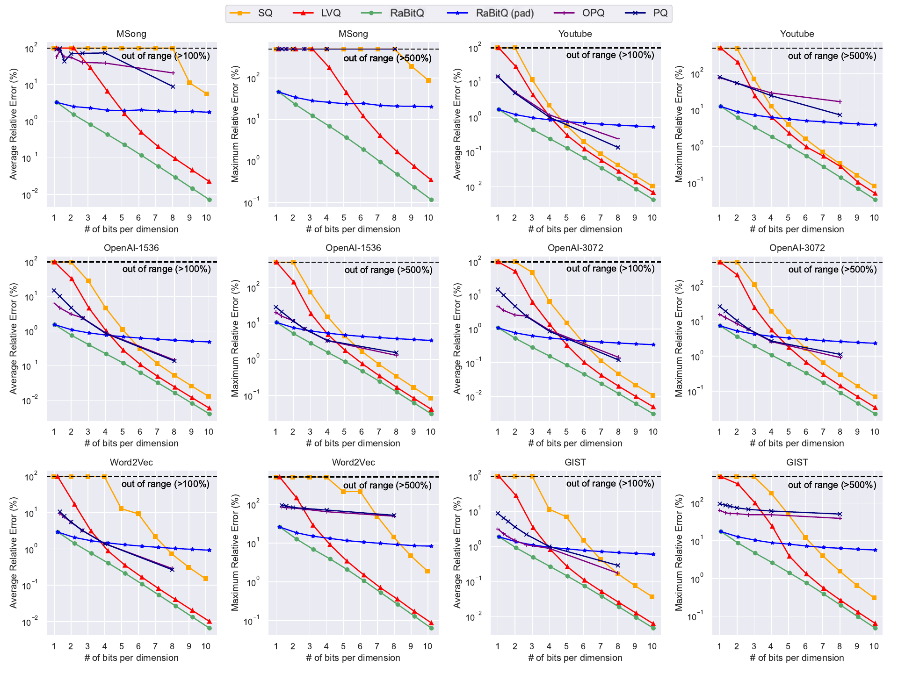

<div align="center">

<h1>RaBitQ Library</h1>

<h3>Compact vectors. Accurate distances. Fast ANN search.</h3>

<p>
  A research-backed C++17 library with Python bindings for 1-bit and multi-bit<br>
  vector quantization, IVF, HNSW, and SymphonyQG.
</p>

<p>
  <a href="https://pypi.org/project/rabitqlib/"></a>
  <a href="https://pypi.org/project/rabitqlib/"></a>
  <a href="https://github.com/VectorDB-NTU/RaBitQ-Library/actions/workflows/test.yaml"></a>
  <a href="https://github.com/VectorDB-NTU/RaBitQ-Library/actions/workflows/python.yml"></a>
  <a href="https://vectordb-ntu.github.io/RaBitQ-Library/"></a>
  <a href="https://doi.org/10.1145/3725413"></a>
  <a href="LICENSE"></a>
</p>

<p>
  <a href="https://vectordb-ntu.github.io/RaBitQ-Library/">Documentation</a> ·
  <a href="https://pypi.org/project/rabitqlib/">Python package</a> ·
  <a href="https://doi.org/10.1145/3725413">Paper</a> ·
  <a href="https://github.com/VectorDB-NTU/RaBitQ-Library/releases">Releases</a>
</p>

</div>

## Install

```bash
pip install rabitqlib
```

Prebuilt wheels support Linux x86-64 and CPython 3.9–3.14. AVX2 + FMA is the
portable CPU baseline; supported AVX-512 kernels are selected at runtime.

## Adopted across the vector-search ecosystem

[Milvus](https://github.com/milvus-io/milvus) ·
[Faiss](https://github.com/facebookresearch/faiss) ·
[VSAG](https://github.com/antgroup/vsag) ·
[VectorChord](https://github.com/tensorchord/VectorChord) ·
[Volcengine OpenSearch](https://www.volcengine.com/docs/6465/1553583) ·
[CockroachDB](https://github.com/cockroachdb/cockroach) ·
[Elasticsearch](https://github.com/elastic/elasticsearch) ·
[Lucene](https://github.com/apache/lucene) ·
[turbopuffer](https://turbopuffer.com/blog/ann-v3#:~:text=ANN%20v3%20employs%20the%20RaBitQ) ·
[Zvec](https://github.com/alibaba/zvec)

## Accuracy at a glance



*Average and maximum relative estimation error across six datasets; lower is
better. Results from the
[multi-bit RaBitQ paper](https://arxiv.org/abs/2409.09913).*

## Why RaBitQ?

| | |
| --- | --- |
| **Compact by design** | Choose [1-bit](https://arxiv.org/abs/2405.12497) or [multi-bit](https://arxiv.org/abs/2409.09913) codes to match your memory and accuracy target. |
| **Accurate estimates** | An asymptotically optimal theoretical error bound supports reliable ordering and reranking. |
| **Fast on x86-64** | Dedicated AVX2 and AVX-512 kernels are selected through runtime CPU dispatch. |
| **Ready for ANN search** | Use the quantizer directly or build complete IVF, HNSW, and [SymphonyQG](https://dl.acm.org/doi/abs/10.1145/3709730) indexes. |

The library supports Euclidean distance and inner product. Cosine search is
available by normalizing vectors before using inner product.

RaBitQ is developed by the
[VectorDB group](https://vectordb-ntu.github.io/) at Nanyang Technological
University, Singapore. A GPU implementation is also available in
[cuvs_rabitq](https://github.com/Stardust-SJF/cuvs_rabitq/tree/cuvs_ivf_rabitq).

## Python quick start

The following complete example builds a small IVF index and searches it. It
uses deterministic synthetic data, so no dataset download is required.

```python
import numpy as np
from rabitqlib import IvfIndex

rng = np.random.default_rng(42)
data = rng.standard_normal((500, 64)).astype(np.float32)
queries = rng.standard_normal((5, 64)).astype(np.float32)

# Assign vectors to five clusters and calculate their centroids.
cluster_ids = (np.arange(len(data)) % 5).astype(np.uint32)
centroids = np.stack(
    [data[cluster_ids == cluster].mean(axis=0) for cluster in range(5)]
).astype(np.float32)

index = IvfIndex(
    dim=64,
    max_elements=len(data),
    num_clusters=5,
    nbits=4,
    metric="l2",
)
index.build(data, centroids, cluster_ids)

ids, distances = index.search(queries, k=10, nprobe=5)
print(ids.shape, distances.shape)  # (5, 10) (5, 10)
print(ids[0])
```

Python bindings are also available for `HnswIndex` and `SymqgIndex`. See the
[Python examples](sample/python/) for index construction, querying, and index
persistence.

<details>
<summary>Build the Python bindings from source</summary>

Source builds require a C++17 compiler, CMake 3.15 or newer, and OpenMP. On
Ubuntu or Debian:

```bash
sudo apt-get update
sudo apt-get install -y build-essential cmake libomp-dev
git clone https://github.com/VectorDB-NTU/RaBitQ-Library.git
cd RaBitQ-Library
python -m pip install .
```

</details>

## C++ quick start

### Requirements

- CMake 3.15 or newer
- a C++17 compiler with OpenMP support
- an x86-64 CPU supported by the selected kernels: most paths accept either
  AVX2 with FMA or AVX-512F/BW/DQ with FMA

<details>
<summary>CPU dispatch details</summary>

Most SIMD entry points select AVX-512 kernels when AVX-512F, AVX-512BW, and
AVX-512DQ are detected; otherwise they use AVX2 when AVX2 and FMA are
available. AVX-512 VPOPCNTDQ enables additional popcount kernels. The HNSW
AVX-512 core path also checks for AVX2 and FMA. AVX-512 translation units are
compiled with FMA enabled.

</details>

Clone and build the library and example programs:

```bash
git clone https://github.com/VectorDB-NTU/RaBitQ-Library.git
cd RaBitQ-Library

cmake -S . -B build -DCMAKE_BUILD_TYPE=Release
cmake --build build --parallel
```

Release builds enable native CPU tuning by default. To build a binary that can
be moved between AVX2- and AVX-512-capable machines, configure with
`-DRABITQ_ENABLE_NATIVE_OPTIMIZATION=OFF`; the ISA-specific kernels will still
be selected at runtime.

The index example executables are written to `bin/`. Their source code shows
the complete indexing and querying workflows:

- [IVF + RaBitQ](sample/cpp/ivf_rabitq_indexing.cpp)
- [HNSW + RaBitQ](sample/cpp/hnsw_rabitq_indexing.cpp)
- [SymphonyQG](sample/cpp/symqg_indexing.cpp)

A separate [RaBitQ quantization example](sample/cpp/quantizer.cpp) demonstrates
the lower-level quantizer API; it is provided as source and is not currently a
CMake target.

To build and run the C++ test suite:

```bash
cmake -S . -B build -DRABITQ_BUILD_TESTS=ON -DCMAKE_BUILD_TYPE=Release
cmake --build build --parallel
ctest --test-dir build --output-on-failure
```

GoogleTest is downloaded during test configuration. For a full benchmark on
the GIST dataset, see [`example.sh`](example.sh). More detailed API and
algorithm guidance is available in the [documentation](docs/docs/index.md).

## Choose the right building block

| Component | Best fit | Storage and search profile |
| --- | --- | --- |
| **Quantizer** | Integrating RaBitQ into an existing system | Low-level 1-bit or multi-bit encoding and distance estimation. |
| **IVF** | Memory-efficient partitioned search | Stores quantized codes without retaining the raw dataset. |
| **HNSW** | Graph search with compact vectors | Adds graph links and searches directly from quantized codes. |
| **SymphonyQG** | Query speed when more memory is available | Retains raw vectors and stores per-neighborhood quantization data. |

IVF and SymphonyQG use [FastScan](https://arxiv.org/abs/1704.07355) for batched
estimates, while HNSW uses single-code AVX2 or AVX-512 kernels.

In typical workloads, 4-bit, 5-bit, and 7-bit quantization can achieve roughly
90%, 95%, and 99% recall, respectively, without reranking. Actual results
depend on the dataset, index configuration, and search parameters.

## Citation

If RaBitQ helps your research or system, please cite:

> Jianyang Gao, Yutong Gou, Yuexuan Xu, Yongyi Yang, Cheng Long, and Raymond
> Chi-Wing Wong. “Practical and Asymptotically Optimal Quantization of
> High-Dimensional Vectors in Euclidean Space for Approximate Nearest Neighbor
> Search.” SIGMOD 2025. [arXiv:2409.09913](https://arxiv.org/abs/2409.09913).

## Contributing

Contributions are welcome. See the [contributing guide](CONTRIBUTING.md) for
the build, formatting, pre-commit, and static-analysis workflows.

## Acknowledgements

RaBitQ Library is developed by Yutong Gou, Jianyang Gao, Yuexuan Xu, Jifan Shi,
and Zhonghao Yang. We thank Alexandr Guzhva, Li Liu, Chao Gao, Silu Huang,
Jiabao Jin, Xiaoyao Zhong, and Jinjing Zhou for their valuable feedback.

## License

RaBitQ Library is available under the [Apache License 2.0](LICENSE).
