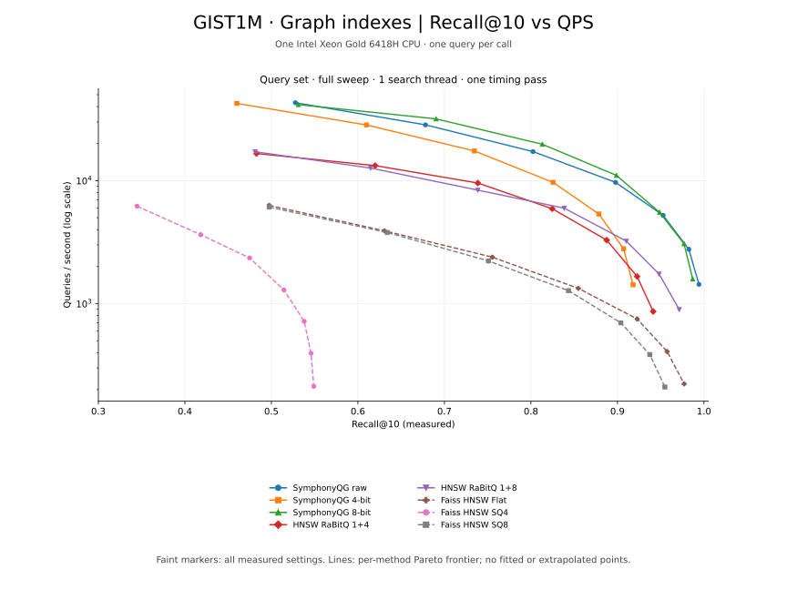
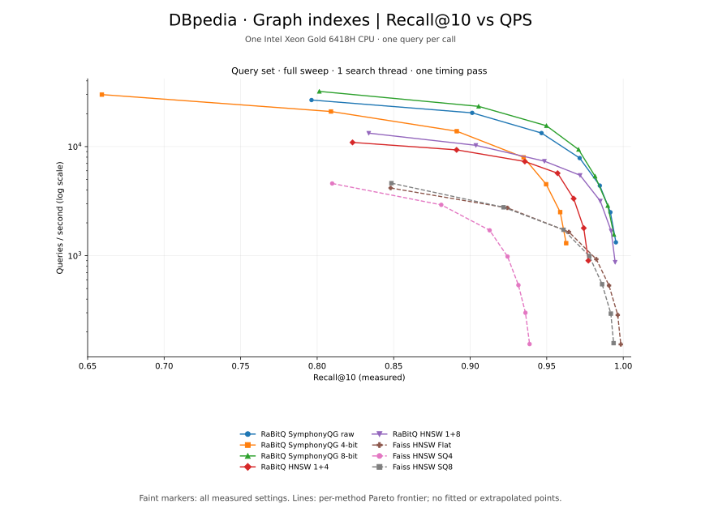

# Graph benchmark

Settings and results for eight configurations. See the [overview](bench.md) for
hardware, datasets, and measurement definitions.

## Index configurations

SymphonyQG uses maximum degree 32, `ef_construction=200`, `init="pipnn"`, and one
refinement iteration. Both HNSW implementations use `M=16` and
`efConstruction=200`, giving a base-layer degree bound of 32.

| Method | Stored representation | Additional construction settings |
| --- | --- | --- |
| SymphonyQG raw | `quantization_bits=0`, raw vectors | Degree 32, PIPNN initialization |
| SymphonyQG 4-bit | `quantization_bits=4` | Degree 32, PIPNN initialization |
| SymphonyQG 8-bit | `quantization_bits=8` | Degree 32, PIPNN initialization |
| HNSW RaBitQ 1+4 | `nbits=5` | `M=16`, seed 42, 16 residual centroids |
| HNSW RaBitQ 1+8 | `nbits=9` | `M=16`, seed 42, 16 residual centroids |
| Faiss HNSW Flat | `HNSW16` | Float32 vectors |
| Faiss HNSW SQ4 | `HNSW16_SQ4` | Four-bit scalar quantization |
| Faiss HNSW SQ8 | `HNSW16_SQ8` | Eight-bit scalar quantization |

HNSW RaBitQ trains 16 centroids with RaBitQKMeans (up to 10 iterations, seed 42,
exact final assignment, spherical training for DBpedia's inner-product metric).
Training is included in construction time. SymphonyQG 4/8-bit and HNSW
1+4/1+8 use different encodings; serialized sizes include their full storage costs.

All graph methods sweep `ef=16,32,64,128,256,512,1024` (Faiss calls this
`efSearch`).

## Reading the results

Curves use one search thread and one query per call over all 1,000 queries.
Indexes are built with 48 threads and reused for the query sweeps.
See [figure definitions](bench.md#reading-the-figures) and
[indexing metrics](bench.md#reading-the-indexing-tables).

## GIST1M

### Indexing time and size

<!-- indexing:gist1m:start -->
| Method | Train s | Construct s | Total s | Save s | Index GiB |
| --- | ---: | ---: | ---: | ---: | ---: |
| SymphonyQG raw | 0.00 | 38.74 | 38.74 | 3.27 | 7.51 |
| SymphonyQG 4-bit | 0.00 | 38.41 | 38.41 | 1.86 | 4.39 |
| SymphonyQG 8-bit | 0.00 | 38.42 | 38.42 | 2.04 | 4.84 |
| HNSW RaBitQ 1+4 | 1.24 | 70.57 | 71.81 | 0.35 | 0.72 |
| HNSW RaBitQ 1+8 | 1.39 | 76.69 | 78.09 | 0.55 | 1.16 |
| Faiss HNSW Flat | 0.00 | 78.94 | 78.94 | 1.61 | 3.71 |
| Faiss HNSW SQ4 | 1.06 | 55.11 | 56.17 | 0.24 | 0.58 |
| Faiss HNSW SQ8 | 1.08 | 47.12 | 48.20 | 0.42 | 1.03 |
<!-- indexing:gist1m:end -->

## DBpedia

### Indexing time and size

<!-- indexing:dbpedia:start -->
| Method | Train s | Construct s | Total s | Save s | Index GiB |
| --- | ---: | ---: | ---: | ---: | ---: |
| SymphonyQG raw | 0.00 | 59.40 | 59.40 | 5.06 | 11.79 |
| SymphonyQG 4-bit | 0.00 | 57.92 | 57.92 | 2.85 | 6.80 |
| SymphonyQG 8-bit | 0.00 | 57.17 | 57.17 | 3.35 | 7.51 |
| HNSW RaBitQ 1+4 | 1.59 | 111.02 | 112.61 | 0.57 | 1.05 |
| HNSW RaBitQ 1+8 | 1.53 | 122.57 | 124.10 | 0.83 | 1.76 |
| Faiss HNSW Flat | 0.00 | 147.53 | 147.53 | 2.69 | 5.85 |
| Faiss HNSW SQ4 | 1.74 | 101.82 | 103.57 | 0.36 | 0.85 |
| Faiss HNSW SQ8 | 1.79 | 80.66 | 82.45 | 0.64 | 1.56 |
<!-- indexing:dbpedia:end -->

## Download measurements

[QPS–recall CSV](figures/qps-recall-points.csv) · [Indexing CSV](figures/indexing.csv)
