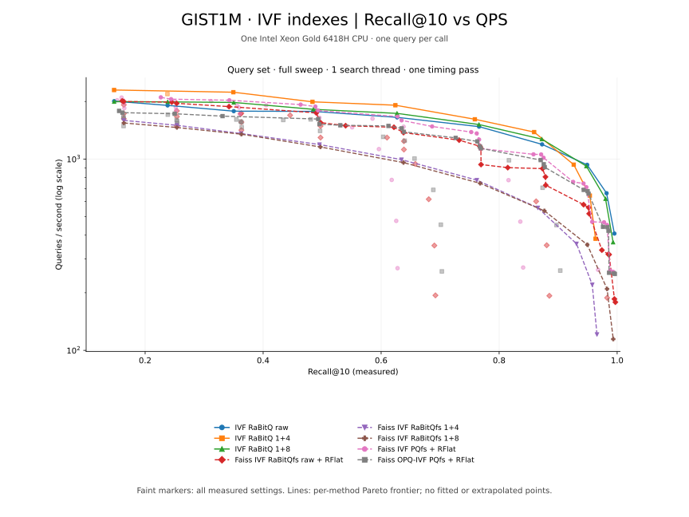
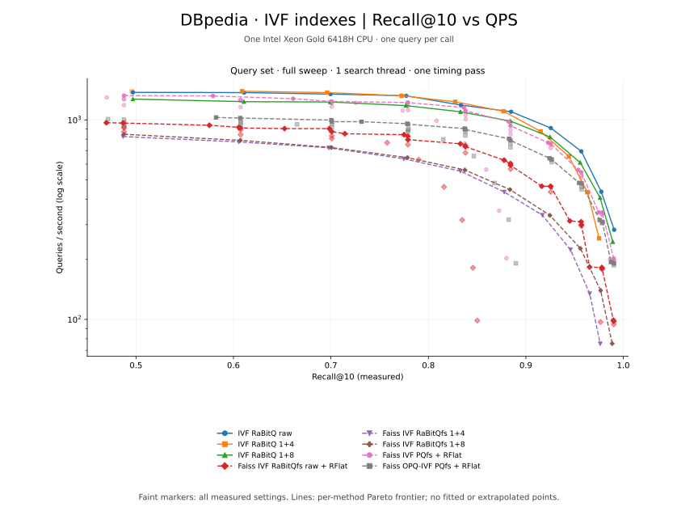

# IVF benchmark

Settings and results for eight configurations. See the [overview](bench.md) for
hardware, datasets, and measurement definitions.

## Index configurations

Every IVF index uses **4,096 clusters**. `d` is the dataset dimension and
`m=d/2` for PQ: 480 on GIST1M and 768 on DBpedia. PQ subquantizers
use four bits. RaBitQ clustering uses up to 10 iterations, seed 42, exact final
assignment, and spherical training for DBpedia's inner-product metric. Faiss uses its
factory training defaults. Training is included in construction time.

| Method | Construction specification | Search parameters |
| --- | --- | --- |
| IVF RaBitQ raw | `IvfIndex(nbits=32)`; one-bit filter with original float32 vectors | `nprobe` |
| IVF RaBitQ 1+4 | `IvfIndex(nbits=5)` | `nprobe` |
| IVF RaBitQ 1+8 | `IvfIndex(nbits=9)` | `nprobe` |
| Faiss IVF RaBitQfs raw + RFlat | `HRd,IVF4096,RaBitQfs1,RFlat` | `nprobe`, `k_factor` |
| Faiss IVF RaBitQfs 1+4 | `HRd,IVF4096,RaBitQfs5` | `nprobe` |
| Faiss IVF RaBitQfs 1+8 | `HRd,IVF4096,RaBitQfs9` | `nprobe` |
| Faiss IVF PQfs + RFlat | `IVF4096,PQ{m}x4fs,RFlat` | `nprobe`, `k_factor` |
| Faiss OPQ-IVF PQfs + RFlat | `OPQ{m},IVF4096,PQ{m}x4fs,RFlat` | `nprobe`, `k_factor` |

`1+4` and `1+8` denote one sign bit plus four or eight extra bits.
`nbits=32` retains raw float32 vectors in RaBitQ-Library; `RFlat` retains them
for Faiss reranking. Index size and QPS include retained vectors and reranking.

The search grid is `nprobe=1,2,4,8,16,32,64,128,256,512`, crossed with
`k_factor=1,2,5,10,20` for the `RFlat` methods. Quantized IVF RaBitQ uses its
default HACC search mode for total bit widths 5 and 9.

## Reading the results

Curves use one search thread and one query per call over all 1,000 queries.
Indexes are built with 48 threads and reused for the query sweeps.
See [figure definitions](bench.md#reading-the-figures) and
[indexing metrics](bench.md#reading-the-indexing-tables).

## GIST1M

### Indexing time and size

<!-- indexing:gist1m:start -->
| Method | Train s | Construct s | Total s | Save s | Index GiB |
| --- | ---: | ---: | ---: | ---: | ---: |
| IVF RaBitQ raw | 14.70 | 0.66 | 15.37 | 1.55 | 3.73 |
| IVF RaBitQ 1+4 | 14.84 | 1.71 | 16.56 | 0.25 | 0.60 |
| IVF RaBitQ 1+8 | 14.54 | 7.03 | 21.57 | 0.45 | 1.05 |
| Faiss IVF RaBitQfs raw + RFlat | 41.61 | 6.76 | 48.37 | 1.58 | 3.73 |
| Faiss IVF RaBitQfs 1+4 | 41.24 | 13.16 | 54.40 | 0.29 | 0.68 |
| Faiss IVF RaBitQfs 1+8 | 41.38 | 39.82 | 81.20 | 0.52 | 1.19 |
| Faiss IVF PQfs + RFlat | 34.52 | 6.59 | 41.11 | 1.59 | 3.84 |
| Faiss OPQ-IVF PQfs + RFlat | 232.45 | 7.51 | 239.97 | 1.63 | 3.84 |
<!-- indexing:gist1m:end -->

## DBpedia

### Indexing time and size

<!-- indexing:dbpedia:start -->
| Method | Train s | Construct s | Total s | Save s | Index GiB |
| --- | ---: | ---: | ---: | ---: | ---: |
| IVF RaBitQ raw | 24.29 | 1.89 | 26.18 | 2.58 | 5.95 |
| IVF RaBitQ 1+4 | 24.33 | 2.89 | 27.22 | 0.40 | 0.95 |
| IVF RaBitQ 1+8 | 24.36 | 12.42 | 36.77 | 0.70 | 1.67 |
| Faiss IVF RaBitQfs raw + RFlat | 85.29 | 12.97 | 98.26 | 2.71 | 6.02 |
| Faiss IVF RaBitQfs 1+4 | 86.94 | 28.05 | 114.99 | 0.60 | 1.33 |
| Faiss IVF RaBitQfs 1+8 | 119.86 | 91.11 | 210.97 | 1.00 | 2.34 |
| Faiss IVF PQfs + RFlat | 99.82 | 15.40 | 115.22 | 2.56 | 6.13 |
| Faiss OPQ-IVF PQfs + RFlat | 1414.28 | 13.65 | 1427.93 | 2.73 | 6.14 |
<!-- indexing:dbpedia:end -->

## Download measurements

[QPS–recall CSV](figures/qps-recall-points.csv) · [Indexing CSV](figures/indexing.csv)
