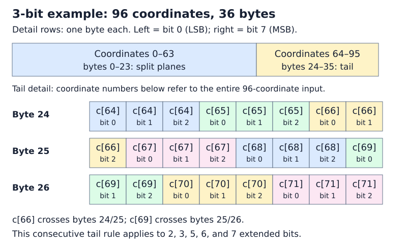
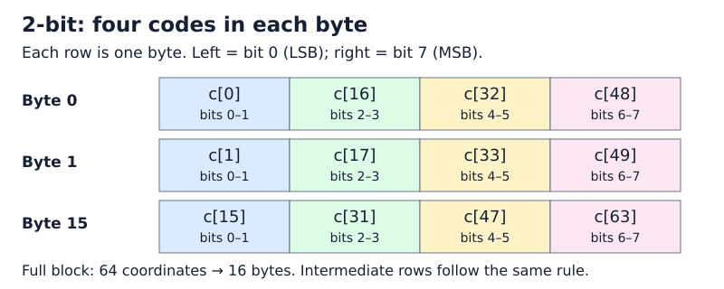
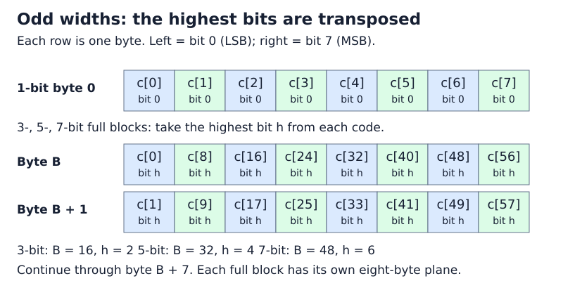
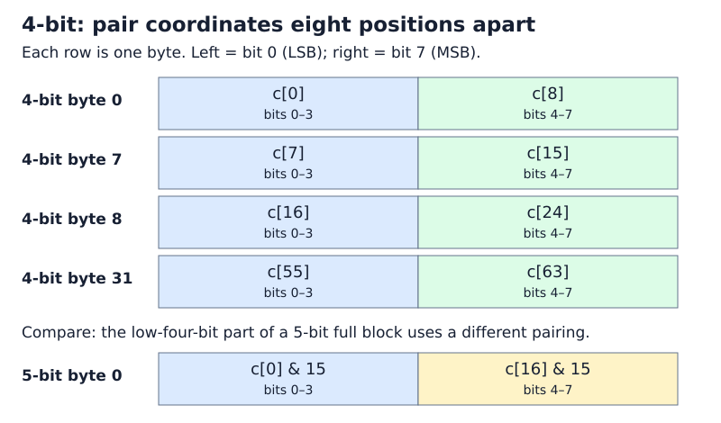

# Compact Storage of Codes

This section describes packing **extended codes** with 1–8 bits per dimension.
IVF and HNSW store a separate sign bit, giving total quantized widths of 1–9 bits;
one-bit quantization has no extended code. These layouts accept dimensions that
are multiples of 32. Pass the padded dimension and already padded, quantized
codes: the packing function does not add padding itself. For rotated vectors,
use the dimension returned by `rotator->size()`; see [Random Rotation](rabitq/rotator.md).
The implementation is in
`rabitqlib/quantization/pack_excode.hpp`.

## How to read the layouts

**The padding requirement is 32 coordinates, not 64.** New indexes round the
original dimension up to a multiple of 32. The 64-coordinate blocks below
describe how codes are arranged in memory after padding; they do not impose
another padding step.

For 2, 3, 5, 6, and 7 extended bits, packing processes as many complete
64-coordinate blocks as fit, followed by a compact 32-coordinate tail when
needed. For example:

| Original dimension | Padded dimension | Packed layout for 2, 3, 5, 6, or 7 extended bits |
| --- | --- | --- |
| 65 | 96 | One 64-coordinate block + one 32-coordinate tail |
| 96 | 96 | One 64-coordinate block + one 32-coordinate tail |
| 97 | 128 | Two 64-coordinate blocks |
| 129 | 160 | Two 64-coordinate blocks + one 32-coordinate tail |

At the packing API, a 32-coordinate input uses only the tail layout for these
widths, with no complete block. Rotators and indexes have their own supported
input-dimension ranges; this packing rule does not change them.

For 1, 4, and 8 extended bits, the layout repeats in smaller units and needs no
special tail encoding. The figures group 64 coordinates only to make comparison
with the other widths easier. For every width, `dim` padded coordinates occupy
exactly `dim * bits / 8` bytes; no unused half-block is stored.

Throughout this page, `c[i]` is the unsigned extended code at coordinate `i`
within the current block, in the range `0` through `(1 << bits) - 1`.
Byte offsets are relative to that block, bit 0 is the least-significant bit,
and division in offset formulas is integer division. These are extended-code
layouts, not the separate sign-code layout used by IVF and HNSW.

Within each byte-layout example, byte addresses increase from top to bottom, and bit positions
increase **from left to right: bit 0 (LSB) to bit 7 (MSB)**. This is the reverse
of how a binary number is usually written. A box labeled `c[16]` means the code
at coordinate 16, not the literal value 16. Where a code is split, the second
line identifies which source bits are stored. Colors only help separate fields;
the labels specify the layout.

To locate a code, first identify its 64-coordinate block, then apply the
corresponding byte layout below. If the last block has only 32 coordinates,
use the tail layout instead. Each complete block occupies `8 * bits` bytes,
so the second block starts at byte `8 * bits`, the third at `16 * bits`, and so on.

## Final 32-coordinate tail

- **1 bit:** Store the 32 binary values sequentially in 4 bytes.
- **2, 3, 5, 6, or 7 bits:** After the complete 64-coordinate blocks, append
  the remaining 32 codes in coordinate order, least-significant bit first,
  as a contiguous bit stream of `32 * bits / 8` bytes. The split-plane layouts
  illustrated below apply only to complete blocks.
- **4 bits:** Continue the existing 16-coordinate layout for two groups,
  using 16 bytes in total; no special tail encoding is needed.
- **8 bits:** Append the 32 code bytes directly.

For example, 96 coordinates at 3 extended bits use a 24-byte full block
followed by a 12-byte tail, for 36 bytes total. The diagram below uses global
coordinate and byte offsets to show where the tail begins. Each small box in
the detail represents one stored bit; a code can cross a byte boundary.



Use `unpacking_rabitqplus_code` with the same dimension and extended bit width to
recover the codes; the packed layout is independent of the selected SIMD backend.


## 1-bit

Each complete block occupies eight bytes. Code `c[i]` is stored in bit
`i % 8` of byte `i / 8`: byte 0 contains coordinates 0–7, from the least
to the most significant bit. A 32-coordinate tail follows the same order
and occupies four bytes.

## 2-bit



Each complete block occupies 16 bytes. Each row in the figure represents a
byte, with the fields shown from least to most significant, left to right.
For `j = 0, ..., 15`, byte `j` contains:

| Bits 0–1 | Bits 2–3 | Bits 4–5 | Bits 6–7 |
| --- | --- | --- | --- |
| `c[j]` | `c[16 + j]` | `c[32 + j]` | `c[48 + j]` |

For example, byte 0 is `c[0] | (c[16] << 2) | (c[32] << 4) | (c[48] << 6)`.
The final 32-coordinate tail uses the contiguous bit stream described above,
not a truncated version of this full-block layout.

## 3-bit = 2-bit + 1-bit

Each complete block occupies 24 bytes. The first 16 bytes use the 2-bit
layout above with each code masked by `3`. The last eight bytes store bit 2
of each code in a transposed bit plane: coordinate `i` maps to bit `i / 8`
of byte `16 + i % 8`.

For example, byte 16 contains the highest bits of coordinates
0, 8, 16, 24, 32, 40, 48, and 56, in increasing bit order. This differs from
the standalone 1-bit layout, whose first byte contains coordinates 0–7.
A final 32-coordinate tail instead stores all three bits of each code
consecutively, as described above.



## 4-bit

Each complete 64-coordinate block occupies 32 bytes, organized as four
16-coordinate groups. In each group, the first eight codes occupy the low
nibbles and the next eight occupy the high nibbles.



For `j = 0, ..., 7`:

| Byte offset | Low nibble (bits 0–3) | High nibble (bits 4–7) |
| --- | --- | --- |
| `j` | `c[j]` | `c[8 + j]` |
| `8 + j` | `c[16 + j]` | `c[24 + j]` |
| `16 + j` | `c[32 + j]` | `c[40 + j]` |
| `24 + j` | `c[48 + j]` | `c[56 + j]` |

For example, byte 0 is `c[0] | (c[8] << 4)`, and byte 31 is
`c[55] | (c[63] << 4)`. If `c[0] = 3` and `c[8] = 10`, byte 0 is
`3 | (10 << 4) = 0xA3`. The diagram places the low nibble `3` on the left;
hexadecimal notation writes the high nibble `A` first.

This layout supports efficient shifting and masking
in the library's AVX2, AVX-512, and NEON unpacking kernels.

## 5-bit = 4-bit + 1-bit

This decomposition describes the bit widths, not a concatenation of the
standalone 4-bit and 1-bit encodings. For a complete 64-coordinate block,
the first 32 bytes store the low four bits with a different coordinate pairing.
For `j = 0, ..., 15`:

| Byte offset | Low nibble (bits 0–3) | High nibble (bits 4–7) |
| --- | --- | --- |
| `j` | `c[j] & 15` | `c[16 + j] & 15` |
| `16 + j` | `c[32 + j] & 15` | `c[48 + j] & 15` |

The remaining eight bytes store bit 4 of each code: coordinate `i` maps to
bit `i / 8` of byte `32 + i % 8`. As in the 3-bit layout, this is a
transposed bit plane, not the standalone 1-bit layout. The block occupies
40 bytes in total. A final 32-coordinate tail instead uses the contiguous
bit stream described above.

## 6-bit

Each complete 64-coordinate block occupies 48 bytes. Codes 0–47 occupy
the low six bits of their respective bytes. Codes 48–63 are split into three
two-bit pieces, stored in the high two bits of the three 16-byte groups.

![6-bit layout showing c[48] split across the high two bits of bytes 0, 16, and 32, beside the complete codes c[0], c[16], and c[32].](assets/img/compact/6bit.svg)

For `j = 0, ..., 15`:

| Byte offset | Low six bits (bits 0–5) | High two bits (bits 6–7) |
| --- | --- | --- |
| `j` | `c[j]` | `c[48 + j] & 3` (code bits 0–1) |
| `16 + j` | `c[16 + j]` | `(c[48 + j] >> 2) & 3` (code bits 2–3) |
| `32 + j` | `c[32 + j]` | `(c[48 + j] >> 4) & 3` (code bits 4–5) |

For example, byte 0 is `c[0] | ((c[48] & 3) << 6)`, and byte 32 is
`c[32] | (((c[48] >> 4) & 3) << 6)`.

This layout supports efficient shifting and masking in the library's AVX2, AVX-512, and NEON unpacking kernels.

## 7-bit = 6-bit + 1-bit

Each complete block occupies 56 bytes. The first 48 bytes use the 6-bit
layout above with each code masked by `63`. The last eight bytes store bit 6
of each code in the same transposed order used for 3-bit and 5-bit codes:
coordinate `i` maps to bit `i / 8` of byte `48 + i % 8`.

For example, byte 48 contains the highest bits of coordinates
0, 8, 16, 24, 32, 40, 48, and 56, in increasing bit order. It does not use
the standalone 1-bit layout. A final 32-coordinate tail instead stores all
seven bits of each code consecutively, as described above.

## 8-bit

Each code is copied directly: byte `i` is `c[i]`. A complete block occupies
64 bytes, and a final 32-coordinate tail occupies 32 bytes.

## Packing API example

```cpp
#include <rabitqlib/quantization/pack_excode.hpp>
#include <cstddef>
#include <cstdint>
#include <cstdlib>
#include <vector>

int main(){
    size_t dim = 768;
    size_t bits = 4;

    std::vector<uint8_t> code(dim);
    // Generate random 4-bit values (0-15) for each dimension
    for (size_t i = 0; i < dim; ++i) {
        code[i] = rand() % 16;  // 4-bit values range from 0 to 15
    }

    std::vector<uint8_t> compact_code(dim * bits / 8);

    rabitqlib::quant::rabitq_impl::ex_bits::packing_rabitqplus_code(
        code.data(), compact_code.data(), dim, bits
    );
}

```
